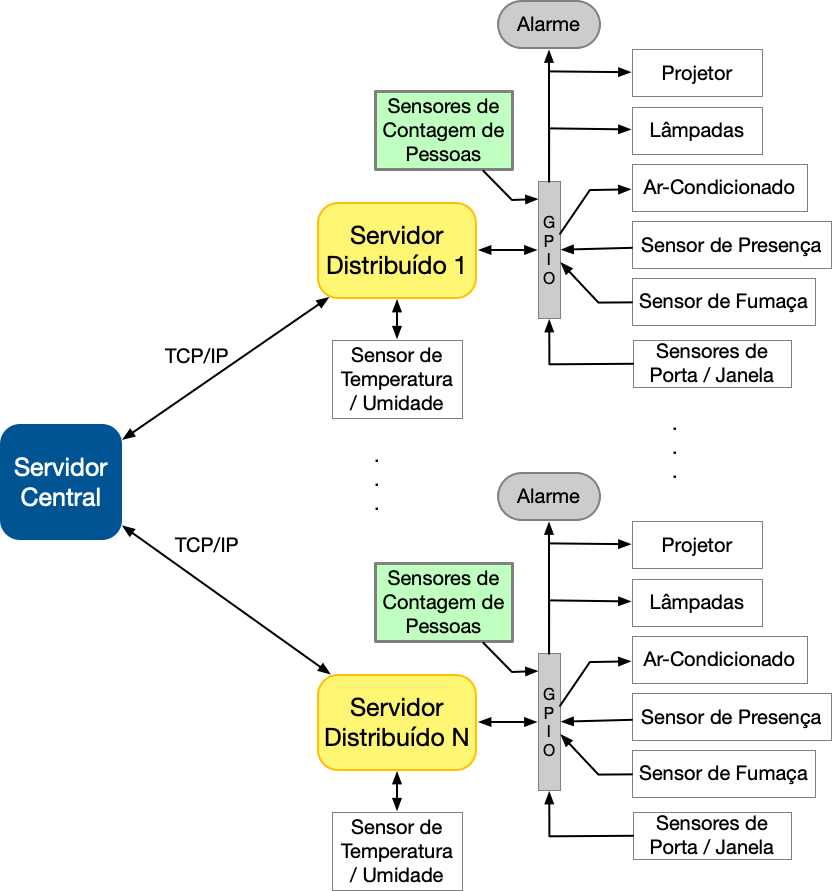

# Projeto 1 - FSE

## Introdução

Este trabalho tem por objetivo a criação de um sistema distribuído de automação predial para monitoramento e acionamento de sensores e dispositivos de um prédio com múltiplas salas. O sistema deve ser desenvolvido para funcionar em um conjunto de placas Raspberry Pi com um servidor central responsável pelo controle e interface com o usuário e servidores distribuídos para leitura e acionamento dos dispositivos. Dentre os dispositivos envolvidos estão o monitoramento de temperatura e umidade, sensores de presença, sensores de fumaça, sensores de contagem de pessoas, sensores de abertura e fechamento de portas e janelas, acionamento de lâmpadas, aparelhos de ar-condicionado, alarme e aspersores de água em caso de incêndio.

## Dados do Aluno

| Nome                          | Matrícula  |
| ----------------------------- | ---------- |
| Daniela Soares de Oliveira | 18/0015222 |

## Dependências

[WiringPi GPIO](http://wiringpi.com/)

[ncurses](https://invisible-island.net/ncurses/)

## Arquitetura do Sistema



## Sensores e Dispositivos


## Como Executar

Ao realizar o clone deste repositório em ambas placas Raspberry Pi, em cada um dos terminais, digite os comandos:

### Terminal 1 - Servidor Central

```bash
$ cd Central
$ make
$ make run ou ./bin/bin
```

### Terminal 2 - Servidor Distribuído

```bash
$ cd Distribuido
$ make
$ make run ou ./bin/bin
```

**_OBS: Executar primeiro o servidor central e, em seguida, executar o servidor distribuído._**

## Relatório - Dispositivos de Saída

O log dos comandos acionados dos dispositivos de saída se encontra na pasta `Central/logs/data.csv`.

### Apresentação do Sistema Central


### Apresentação do trabalho 
[Video](https://unbbr.sharepoint.com/sites/PA547/_layouts/15/stream.aspx?id=%2Fsites%2FPA547%2FDocumentos%20Compartilhados%2FGeneral%2FRecordings%2FTrabalho%201%2D20221221%5F112838%2DGrava%C3%A7%C3%A3o%20de%20Reuni%C3%A3o%2Emp4)

## Referências

[DHT22](https://github.com/nebulx29/dht22)

[Biblioteca WiringPi GPIO](http://wiringpi.com/)

[Raspberry Pi Pinout](https://pinout.xyz/)

[Debounce](https://www.filipeflop.com/blog/debounce-o-que-e-e-como-resolver-via-software/)