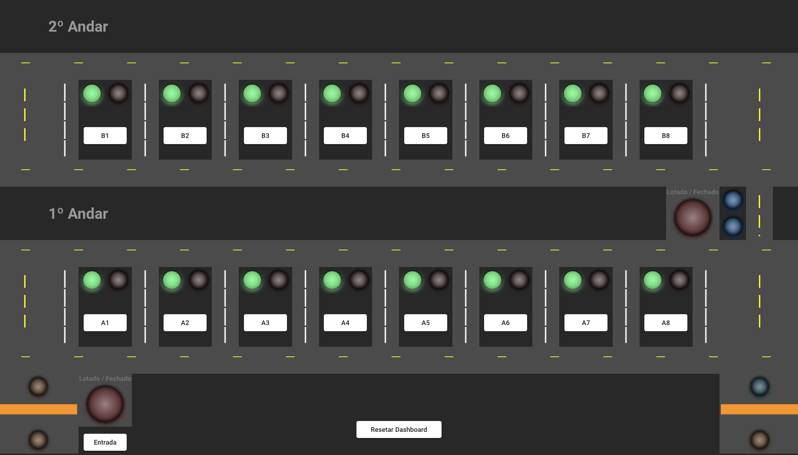
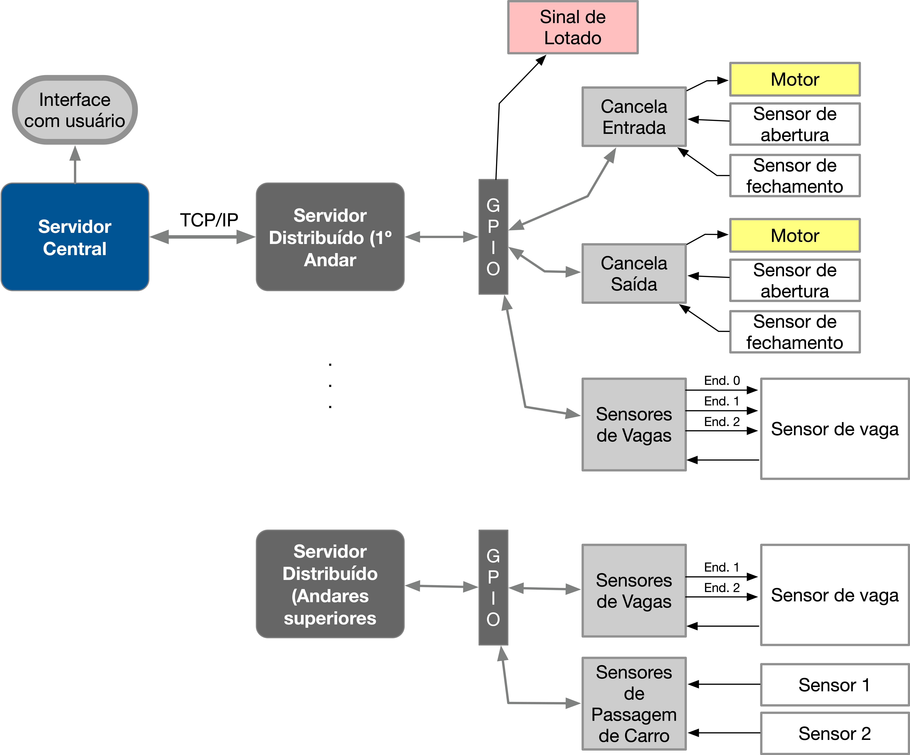

# Projeto 1 - FSE

## Dados do Aluno

| Nome                          | Matrícula  |
| ----------------------------- | ---------- |
| Daniela Soares de Oliveira | 18/0015222 |

## Introdução

Este trabalho tem por objetivo a criação de um sistema distribuído para o controle e monitoramento de estacionamentos comerciais. Dentre os itens controlados teremos a entrada e saída de veículos, a ocupação de cada vaga individualmente, a ocupação do estacionamento como um todo e a cobrança por tempo de permanência.
O sistema deve ser desenvolvido para funcionar em um conjunto de placas Raspberry Pi com um servidor central responsável pelo controle e interface com o usuário e servidores distribuídos para o controle de todos os sensores e atuadores de cada andar do estacionamento.

A Figura 1 mostra o layout do estacionamento.


## Dependências

[RPi.GPIO GPIO](https://pypi.org/project/RPi.GPIO/)


## Arquitetura do Sistema




## Como Executar

Ao realizar o clone deste repositório em ambas placas Raspberry Pi, em cada um dos terminais, digite os comandos:

### Terminal 1 - Servidor Central

```bash
$ cd Central
$ python3 Central.py
```

### Terminal 2 - Servidor Distribuído

```bash
$ cd Distribuido
$ python3 Distribuido2.py
```

**_OBS: Executar primeiro o servidor central e, em seguida, executar o servidor distribuído._**


### Apresentação do Sistema Central


## Referências

## Video


