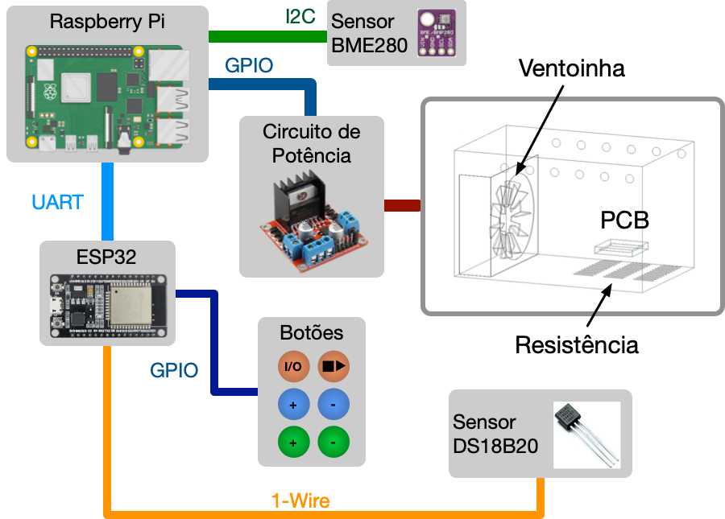
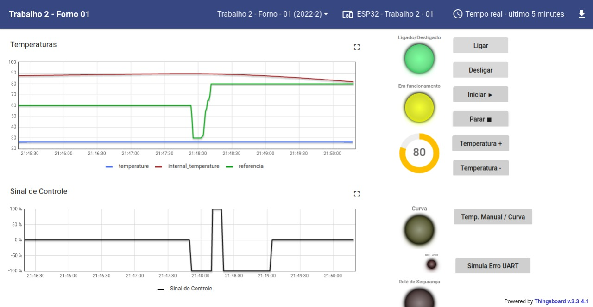
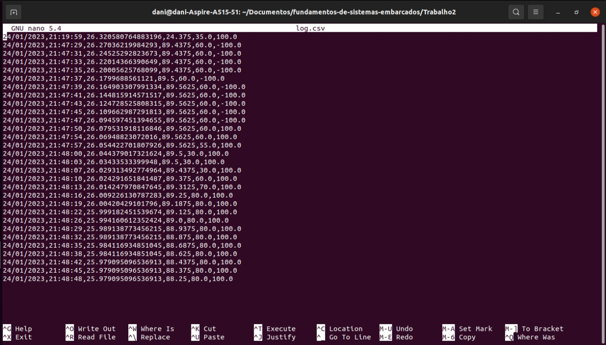

# Projeto 2 - FSE

## Introdução

Este trabalho tem por objetivo a implementação de um sistema (que simula) o controle de um forno para soldagem de placas de circuito impresso (PCBs). Abaixo vemos alguns exemplos de fornos comerciais para este propósito.
## Dados do Aluno

| Nome                          | Matrícula  |
| ----------------------------- | ---------- |
| Daniela Soares de Oliveira | 18/0015222 |

## Dependências

* pyserial
* smbus2
* rpi.bme280


## Arquitetura do Sistema



## Sensores e Dispositivos



## Log



## Como Executar

Ao realizar o clone deste repositório na Raspberry Pi, digite os comandos:

### Terminal

```bash
$ pip install -r requirements.txt
$ python3 main.py
```


### Apresentação do trabalho 
[Video](https://youtu.be/sbwetdXTJrU)

## Referências

[Controle PID](https://pt.wikipedia.org/wiki/Controlador_proporcional_integral_derivativo)

[Controle dde ligar-desligar](https://pt.wikipedia.org/wiki/Controle_liga-desliga)

[bcm2835](http://www.airspayce.com/mikem/bcm2835/)

[wiringpi](http://wiringpi.com/)